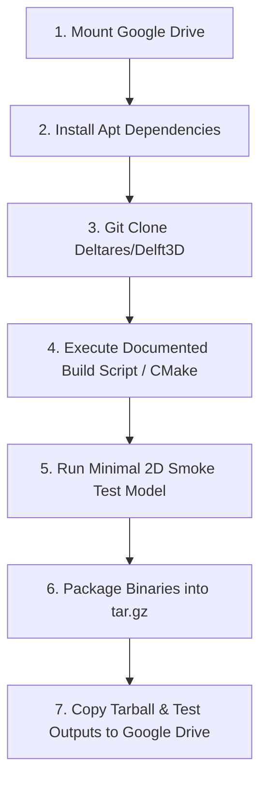

# Plan: Building Delft3D Flexible Mesh (D-Flow FM) from Public GitHub on Linux

> [!NOTE]
> **Status: APPROVED BY USER WITH REVISION TO USE PUBLIC GITHUB REPO.**
> Switched from Deltares SVN server to the public GitHub repository [`Deltares/Delft3D`](https://github.com/Deltares/Delft3D). Build environment and packaging will execute via Google Colab (`notebooks/delft3d_colab_builder.ipynb`) with direct export to Google Drive.

---

## 1. Executive Summary & Objective

While `Delft3DFMAdapter` in PravahX can generate valid HYDROLIB-core model cases (`prepare()`) and extract flood rasters from NetCDF outputs (`postprocess()`), execution of `run()` is currently blocked pending access credentials to the Deltares Harbor container registry (`containers.deltares.nl`).

This document provides the approved plan to compile the open-source **Delft3D Flexible Mesh** engine natively on Ubuntu 22.04 LTS via Google Colab using the public `Deltares/Delft3D` GitHub repository, run a smoke test on a minimal 2D shallow water case, and automatically copy the compiled binaries and libraries directly to Google Drive.

---

## 2. Host Environment & Compiler Setup

### GNU Compiler Collection (GCC & gfortran)
Ubuntu 22.04 on Google Colab provides native GNU compilers:
* **Fortran Compiler:** `gfortran-11` or system `gfortran`.
* **C/C++ Compilers:** `gcc-11`, `g++-11`.
* **MPI:** OpenMPI (`libopenmpi-dev`, `openmpi-bin`).
* **Compiler Flags:** `-fallow-argument-mismatch -fallow-invalid-boz -O2` to accommodate Fortran standard evolution in numerical routines.

---

## 3. Dependency Stack

| Component | Minimum Version | Installation Method | Purpose |
| :--- | :--- | :--- | :--- |
| **CMake** | $\ge 3.24$ | `apt-get install cmake` | Build configuration and generation |
| **Git** | $\ge 2.34$ | Pre-installed on Colab | Source clone from GitHub |
| **NetCDF-C** | $\ge 4.8.1$ | `libnetcdf-dev` | Core NetCDF dataset reader/writer |
| **NetCDF-Fortran** | $\ge 4.5.4$ | `libnetcdff-dev` or source | NetCDF Fortran 90 module (`netcdf.mod`) |
| **HDF5** | $\ge 1.12$ | `libhdf5-dev` | NetCDF-4 backend storage |
| **METIS** | $5.1.0$ | `libmetis-dev` | Unstructured grid domain decomposition for MPI parallelization |
| **DIMR** | Latest tag | Built from `Deltares/Delft3D` source | Deltares Integrated Model Runner coupling orchestrator |

---

## 4. Source Code Retrieval: Public GitHub

* **Repository URL:** `https://github.com/Deltares/Delft3D.git`
* **Access Mode:** Public Git clone (`--depth 1` for shallow fetch).
* **Branch / Tag:** Default public release branch or latest release tag.

---

## 5. Automated Colab Build Workflow

The build workflow is automated in `notebooks/delft3d_colab_builder.ipynb`:



### Step 1: Mount Google Drive
Mounts `/content/drive` so that all compilation artifacts (`delft3dfm_linux_x86_64.tar.gz`) are immediately preserved across sessions.

### Step 2: System Packages & Toolchains
```bash
apt-get update && apt-get install -y \
    build-essential gfortran gcc g++ cmake git \
    libopenmpi-dev openmpi-bin libnetcdf-dev libnetcdff-dev \
    libhdf5-dev libmetis-dev zlib1g-dev
```

### Step 3: Git Clone
```bash
git clone --depth 1 https://github.com/Deltares/Delft3D.git /content/delft3d_src
```

### Step 4: Build Script / CMake Configuration
```bash
python3 -m pip install -q "conan>=2.0"
export CONAN_CPU_COUNT=2
export CMAKE_BUILD_PARALLEL_LEVEL=2
export FFLAGS="-fallow-argument-mismatch -fallow-invalid-boz -O2"
export FCFLAGS="-fallow-argument-mismatch -fallow-invalid-boz -O2"

python3 build.py \
    --config fm-suite \
    --build \
    --build-type Release \
    --build-dependencies \
    --install-dir /content/delft3d_bin
```

### Step 5: Smoke Test
* Executes `dflowfm` or `dimr` on a minimal 100-cell rectangular 2D flume dam-break case.
* Validates that output NetCDF files (`*_map.nc`) are created and contain `mesh2d_waterdepth`.

### Step 6: Package and Copy to Google Drive
* Creates `delft3dfm_linux_x86_64.tar.gz`.
* Generates SHA-256 integrity checksum.
* Copies the tarball to `/content/drive/MyDrive/PravahX/delft3dfm_linux_x86_64.tar.gz`.

---

## 6. Time & Resource Estimates

| Phase | Estimated Duration | Resource Needs |
| :--- | :--- | :--- |
| **System Dependencies & Clone** | 5 – 10 minutes | Standard Colab CPU or GPU VM |
| **CMake Build & Compilation** | 25 – 45 minutes | 2–4 vCPUs, 8–12 GB RAM |
| **Smoke Test & Verification** | 3 – 5 minutes | 1 vCPU |
| **Google Drive Copy** | 2 – 5 minutes | Google Drive storage (~500 MB) |
| **Total Duration** | **35 – 65 minutes** | Single Google Colab session |

---

## 7. Key Risks & Mitigations

1. **Fortran Compiler Argument Mismatch:** Add `-fallow-argument-mismatch` flag to `CMAKE_Fortran_FLAGS` to ensure older routines compile smoothly with modern GCC.
2. **Colab Disconnect / Timeout:** Drive mounting in Step 1 ensures the compiled tarball is copied to user Google Drive immediately upon build completion.
3. **RAM Constraints:** Parallel compilation capped at `nproc` (typically 2–4 cores on Colab) to stay comfortably within 12 GB RAM.

